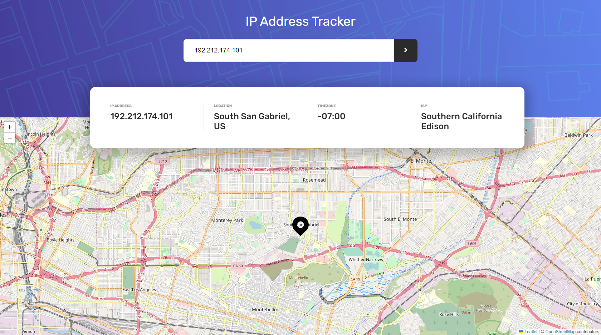

# IP address tracker

Users should be able to:

- View the optimal layout for each page depending on their device's screen size
- See hover states for all interactive elements on the page
- See their own IP address on the map on the initial page load
- Search for any IP addresses or domains and see the key information and location

## Screenshot

### Links

- Solution URL: [GitHub](https://github.com/wonder-filka/IP-address-tracker)
- Live Site URL: [Add live site URL here](https://courageous-begonia-0778bf.netlify.app/)

#### Built with

- HTML5
- CSS
- JavaScript
- AJAX, AXIOS
